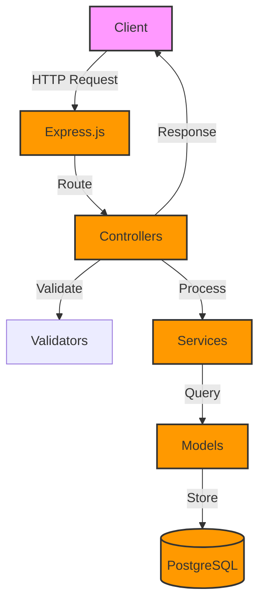

# 📚 Library Management System

<div align="center">


<div style="display: flex; justify-content: center; gap: 1rem; flex-wrap: wrap; margin: 1rem 0;">

[](https://www.typescriptlang.org/)
[](https://nodejs.org/)
[](https://www.postgresql.org/)
[](https://www.docker.com/)
[](https://jestjs.io/)
[](https://expressjs.com/)
[](https://sequelize.org/)

</div>

<div style="display: flex; justify-content: center; gap: 1rem; flex-wrap: wrap; margin: 1rem 0;">

[](LICENSE)
[](CONTRIBUTING.md)
[](https://github.com/ozers/library-management/graphs/commit-activity)
[](https://github.com/ozers/library-management/stargazers)

</div>

---

<h3 style="color: #0366d6; margin: 1rem 0;">🌟 A modern and robust Library Management System built with Node.js and PostgreSQL.</h3>
<h4 style="color: #586069; margin: 1rem 0;">📖 Efficiently manage books, users, and borrowing transactions with ease.</h4>

<div style="display: flex; justify-content: center; gap: 1rem; flex-wrap: wrap; margin: 1rem 0;">

[Quick Start](#-quick-start) •
[Features](#-features) •
[Installation](#-installation) •
[API](#-api) •
[Contributing](#-contributing)

</div>

---

</div>

## 🚀 Quick Start

```bash
# Clone & Install
git clone https://github.com/ozers/library-management.git
cd library-management
cp .env.example .env
npm install

# Start with Docker (Development)
docker-compose -f docker-compose.dev.yml up --build

# Or start without Docker
npm run dev

# Visit: http://localhost:3000
```

## 📊 System Architecture



## ✨ Features

<div style="display: flex; justify-content: flex-start; gap: 2rem; flex-wrap: wrap;">

<div style="flex: 1; min-width: 300px; padding: 1.5rem; border-radius: 8px; border: 1px solid #e1e4e8;">

### 📚 Book Management
- Smart cataloging system
- Real-time availability tracking
- Advanced search capabilities
- Category organization

</div>

<div style="flex: 1; min-width: 300px; padding: 1.5rem; border-radius: 8px; border: 1px solid #e1e4e8;">

### 👥 User Management
- Seamless registration
- Detailed profiles
- Activity monitoring
- Preference settings

</div>

<div style="flex: 1; min-width: 300px; padding: 1.5rem; border-radius: 8px; border: 1px solid #e1e4e8;">

### 🔄 Borrowing System
- One-click borrowing
- Rating-enabled returns
- Overdue notifications
- Reservation system

</div>

</div>

## 🛠 Installation

<div style="display: flex; justify-content: flex-start; gap: 2rem; flex-wrap: wrap;">

<div style="flex: 1; min-width: 300px; padding: 1.5rem; border-radius: 8px; border: 1px solid #e1e4e8;">

### Prerequisites
- Node.js (v14+)
- Docker & Docker Compose
- PostgreSQL
- Git

</div>

<div style="flex: 1; min-width: 300px; padding: 1.5rem; border-radius: 8px; border: 1px solid #e1e4e8;">

### Environment Setup
```env
DB_HOST=db
DB_PORT=5432
DB_NAME=library_db
DB_USER=postgres
DB_PASSWORD=postgres
NODE_ENV=development
PORT=3000
```

</div>

</div>

## 📚 API Endpoints

<div style="display: flex; justify-content: flex-start; gap: 2rem; flex-wrap: wrap;">

<div style="flex: 1; min-width: 300px; padding: 1.5rem; border-radius: 8px; border: 1px solid #e1e4e8;">

### Books
- `GET /api/books` - List all books
- `GET /api/books/:id` - Get book details
- `POST /api/books` - Create new book

</div>

<div style="flex: 1; min-width: 300px; padding: 1.5rem; border-radius: 8px; border: 1px solid #e1e4e8;">

### Users
- `GET /api/users` - List all users
- `GET /api/users/:id` - Get user details
- `POST /api/users` - Create new user

</div>

<div style="flex: 1; min-width: 300px; padding: 1.5rem; border-radius: 8px; border: 1px solid #e1e4e8;">

### Borrowing & Transactions
- `POST /api/borrow/:userId/borrow/:bookId` - Borrow a book
- `POST /api/borrow/:userId/return/:bookId` - Return a book
- `GET /api/transactions/user/:userId` - Get user's transactions
- `GET /api/transactions/:id` - Get transaction details

</div>

</div>

## 📝 Contributing

1. Fork the repository
2. Create feature branch
3. Commit changes
4. Push to branch
5. Create Pull Request

## 📧 Contact & Support

<div align="center">

<div style="display: flex; justify-content: center; gap: 1rem; flex-wrap: wrap; margin: 1rem 0;">

[](mailto:ozersubasi.dev@gmail.com)
[](https://github.com/ozers)
[](https://www.linkedin.com/in/ozer)
[](https://yayinliyor.com)

</div>

</div>

## 📝 License

<div align="center">

<div style="padding: 1.5rem; border-radius: 8px; border: 1px solid #e1e4e8; max-width: 600px;">

### 📜 MIT License
[](LICENSE)

</div>

</div>

---

<div align="center">

<div style="padding: 1.5rem; border-radius: 8px; border: 1px solid #e1e4e8; max-width: 600px;">

### 🌟 Made with ❤️ by [Ozer SUBASI](https://github.com/ozers)

<div style="display: flex; justify-content: center; gap: 1rem; flex-wrap: wrap; margin: 1rem 0;">

[](https://github.com/ozers/library-management/stargazers)
[](https://github.com/ozers/library-management/network/members)
[](https://github.com/ozers/library-management/issues)

</div>

</div>

</div>

